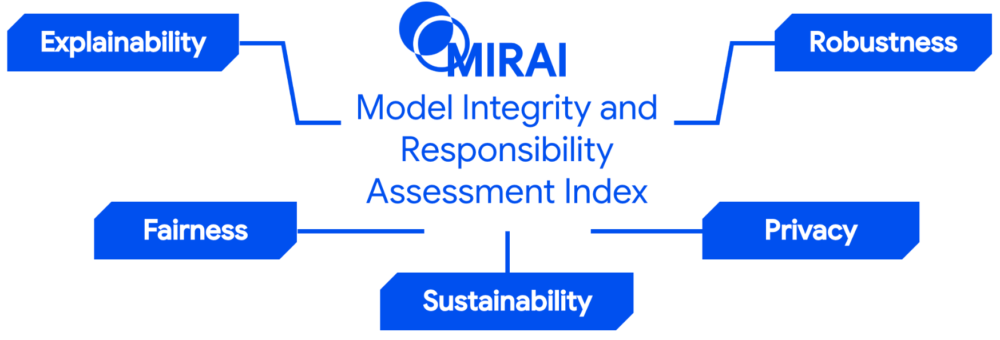

# Multi-Dimensional Model Integrity and Responsibility Assessment Index (MIRAI) and Scoring Framework

## Table of Contents

- [Overview](#overview)
- [Metrics](#metrics)
- [Results](#results)

## Overview

This is the official repository for **MIRAI**, a unified framework for **multi-dimensional evaluation of machine learning models** beyond predictive performance.

MIRAI provides a holistic scoring system that integrates multiple responsible AI dimensions into a single **MIRAI score**, enabling meaningful comparison between models in real-world, high-stakes applications.

  

Artificial Intelligence is increasingly deployed in high-stakes domains, where model outputs directly impact individuals and institutions. Hence reliability and responsibility are critical:

- Accuracy alone is insufficient for evaluation  
- Key dimensions such as fairness, privacy, and robustness are often isolated  
- No unified framework exists to evaluate trade-offs  

MIRAI evaluates models across **five key dimensions**:

- **Explainability**: attribution quality and faithfulness  
- **Fairness**: subgroup disparity and parity metrics  
- **Sustainability**: carbon footprint and compute cost  
- **Robustness**: adversarial and distribution shift  
- **Privacy**: membership inference and leakage  

These dimensions are normalized and aggregated into a unified **MIRAI score**.

We evaluate models across three domains:

- **German Credit** → Financial risk prediction  
- **Diabetes Hospitals** → Healthcare outcome prediction  
- **Census Income** → Socioeconomic classification  

## Metrics

The MIRAI framework evaluates models across five responsible AI dimensions. Each dimension consists of multiple sub-metrics capturing complementary aspects of model behavior.

<strong>Explainability</strong>

To evaluate the explainability of each model, we compute the following metrics using the `Quantus` toolbox:

**1. Complexity**
- **Sparseness** ([Chalasani et al., 2020]): Uses the Gini Index to assess whether only a small subset of features dominates the explanation.
- **Complexity** ([Bhatt et al., 2020]): Computes the entropy of feature attribution distributions.

**2. Faithfulness**
- **Faithfulness Correlation** ([Bhatt et al., 2020]): Measures correlation between feature importance and output change under perturbations.
- **Faithfulness Estimate** ([Alvarez-Melis et al., 2018]): Evaluates prediction changes when important features are removed.

**3. Robustness (Explanation Stability)**
- **Local Lipschitz Estimate** ([Alvarez-Melis et al., 2018]): Quantifies sensitivity of explanations to small input perturbations.
- **Consistency** ([Dasgupta et al., 2022]): Measures stability of explanations across similar inputs.

**4. Randomisation**
- **Model Parameter Randomisation Test (MPRT)** ([Adebayo et al., 2018]): Measures degradation of explanations when model parameters are randomized.
- **Random Logit Test** ([Sixt et al., 2020]): Compares explanations against random outputs to detect spurious attribution.

<strong>Fairness</strong>

Computed using `Fairlearn`:

- **Accuracy Difference**: Disparity in accuracy across groups  
- **Precision Difference**: Difference in positive predictive value  
- **TPR Difference**: Difference in true positive rates  
- **FPR Difference**: Difference in false positive rates  
- **Demographic Parity Difference**: Difference in selection rates  
- **Equalized Odds Difference**: Maximum disparity in TPR and FPR  

All metrics are normalized to [0,1], where higher scores indicate better fairness.

<strong>Sustainability</strong>

- **Number of Parameters**: Model size and memory footprint  
- **FLOPs**: Computational cost per forward pass  
- **MACs**: Hardware-level compute operations  
- **Estimated CO₂ Emissions (Lacoste et al., 2019)**: Carbon footprint based on energy consumption  

Higher scores indicate more efficient and environmentally sustainable models.

<strong>Robustness</strong>

We evaluate robustness across two dimensions:

- **Adversarial Robustness (HSJA Accuracy Gap)**  
  Measures performance degradation under HopSkipJump Attack (Chen et al., 2019), a black-box adversarial attack.

- **Distribution Shift Robustness (MMD Score)**  
  Uses Maximum Mean Discrepancy (Gretton et al., 2012) to detect prediction drift under distribution shifts.

<strong>Privacy</strong>

We quantify privacy risks using:

- **Membership Inference Privacy (Shokri et al., 2017)**  
  Measures resistance to attacks that infer whether a sample was part of training data.

- **SHAPr Privacy (Duddu et al., 2021)**  
  Evaluates leakage via SHAP-based explanation attacks.

**MIRAI Scoring**

We compute the final MIRAI score by aggregating the five dimension scores. Each metric is first normalized to [0,1], and metrics where lower values are better are inverted using \(1 - \text{raw}\). The average of metrics within each dimension defines the **Dimension Score (DS)**.

The final MIRAI score is computed as:

`MIRAI = sum_{d=1}^{5} w_d * DS_d`

where \(w_d = 0.2\) by default. This weighting allows flexible, context-aware evaluation while maintaining comparability. Predictive performance (Accuracy and F1-score) is reported separately.

## Results

<table>
  <thead>
    <tr>
      <th>Dataset</th>
      <th>Model</th>
      <th>F1 Score</th>
      <th>MIRAI Score</th>
    </tr>
  </thead>
  <tbody>

    <tr><td>German Credit</td><td>DT</td><td>0.7070</td><td>0.7282</td></tr>
    <tr><td></td><td>XGB</td><td>0.7460</td><td>0.7086</td></tr>
    <tr><td></td><td>SVM</td><td>0.6910</td><td>0.7377</td></tr>
    <tr><td></td><td>MLP</td><td>0.7330</td><td><strong>0.7422</strong></td></tr>
    <tr><td></td><td>TRN</td><td><strong>0.7520</strong></td><td>0.6540</td></tr>
    <tr><td></td><td>FTT</td><td>0.7340</td><td>0.4815</td></tr>

    <tr><td>Diabetes</td><td>DT</td><td>0.7960</td><td>0.7635</td></tr>
    <tr><td></td><td>XGB</td><td>0.8360</td><td>0.7763</td></tr>
    <tr><td></td><td>SVM</td><td>0.8360</td><td>0.7724</td></tr>
    <tr><td></td><td>MLP</td><td><strong>0.8380</strong></td><td><strong>0.7776</strong></td></tr>
    <tr><td></td><td>TRN</td><td>0.8370</td><td>0.7607</td></tr>
    <tr><td></td><td>FTT</td><td>0.8360</td><td>0.5636</td></tr>

    <tr><td>Census Income</td><td>DT</td><td>0.8140</td><td>0.6925</td></tr>
    <tr><td></td><td>XGB</td><td><strong>0.8630</strong></td><td>0.6890</td></tr>
    <tr><td></td><td>SVM</td><td>0.8440</td><td><strong>0.7209</strong></td></tr>
    <tr><td></td><td>MLP</td><td>0.8500</td><td>0.7189</td></tr>
    <tr><td></td><td>TRN</td><td>0.8460</td><td>0.6881</td></tr>
    <tr><td></td><td>FTT</td><td>0.8480</td><td>0.5698</td></tr>

  </tbody>
</table>

